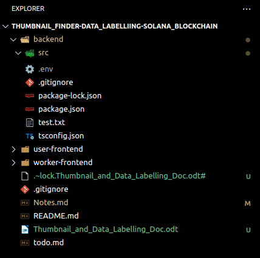

# Notes
------------------------------------------------------------
### Schema
After wiriting the prisma schema , i have to do the migrate it to the original db with the command . 

tinesh@Thor:~/Desktop/github/Thumbnail_Finder-Data_Labelliing-Solana_Blockchain/backend$ 

 npx prisma migrate dev

So after the aboce command, the prisma will create a migration.sql and it will create the tables in the specified database 
---------------------------------------------------

### 23 May 2024 : 
- [x] created a postgress docker container and with the following command, 
  ----->>>>   docker run --detach --env POSTGRES_USER=tinesh-postgresql-docker --env POSTGRES_PASSWORD=dummy --env POSTGRES_DB=ThumbnailFinderDataLabellingSolanaBlockchain --name postgres --publish 5432:5432 postgres:latestargument_1
  
- [x] connected to it in the cli with the command 
  ----->>>>   docker exec -it postgres psql -U tinesh-postgresql-docker -d ThumbnailFinderDataLabellingSolanaBlockchain
  
- [X] I have create a endpoint to login with the wallet address and get a token for the future login

- [X] Created an endpoint to get the presigned url from the aws

- [X] (This takened a lot of time) Tested that presigned url in the postman by specifying all the details

- [] Need to do UI for the third point in the next session

Things to remember in the above : 

    -- Specify the region correctly,  there may be different region for the different bucket.
    -- Refer the website https://fourtheorem.com/the-illustrated-guide-to-s3-pre-signed-urls/
    -- In the post object section in the website, just remove "success_action_status: '201'" attribute from the Fields in the createPresignedPost(), because it will be against our policy, because we have defined a custom policy for restricted access...
    -- Other infromations are correct in the webiste.
    -- Refer that Post Object HTML code to find what are all the things needed to be given while posting an image from the frontend
    -- But some attributes are not needed, so refer the postman for that

-----------------------------------------------------------

(Check the above three codes and postman before moving into the next development, or if you forgot this notes.md and if you see this in the future, now also you can revisit these codes)

(Worked around half in this)...

----------------------------------------------------------

### 1 June 2024 : 

-->> Main work on this day is automating the postman with Run Collection option 
          a) Made the postman to execute multiple request continuously and use the response data of the one request(GET /presignedUrl) to the header of an another request(POST /to amazon s3 bucket url) 
          b) Retesting the user work flow with the automated process

          Todo : (Only finished half part in automating, half part of automation is balance)

          a) Need to automate the process of informing the task information to the backend after uploading multiple images(as needed by the user) to the s3 bucket 
          b) Refer chatgpt for the Test and Pre-Test script files on postman
              refer link : [all info about automating postman on multiple requests](https://chatgpt.com/share/673ab476-09c9-4792-a0fc-0aae32b09b30)

-->> Added two worker endpoints(signIn and nextTask)

          Todo

          a) Need to deal with new task schema
          b) Check whether the particular task has reached its worker count
          c

          Automate the backend saying process 

But only after running (gett presigned urls+post objects ) multiple times and setting theier key into the environmental varialbles or something like that to store the image name(key in post object request)

and say the task info to the backend(make this flow)

----------------------------------------------------------------------------------------------------------

### June 4 2024 :

1 . Fully automated the postman workflow 
            [doc available in the project folder] -->> Refer Doc to remember the workflow

2. Changed the sheama of the Option model to hold option_id 

---------------------------------------------------------------------------------------------------------------